

<h1>Voxel Techniques</h1>

 

This project provides a testing environment for analyzing and comparing various techniques for optimizing voxel-based world representation. The goal of the project is to evaluate different methods for rendering voxel data, focusing on techniques like triangulation and ray tracing, which are commonly used in 3D interactive environments.

A <a href="https://youtu.be/OVThWmk9Qlg">video</a> showing how the app works

## Important note:
> This repository was created solely for the purpose of my Master's thesis titled "Techniques for Optimizing Voxel-Based Representation of the Game World", and it was used during the research phase. The repository has been archived and is no longer open for review or further development. However, I encourage you to read my thesis for detailed insights into the research, methods, and results derived from this testing environment.

## Tested voxel techniques
- Triangulation methods: naive method, face culling, greedy meshing, binary greedy meshing.
- Ray tracing methods: voxel ray marching, brick maps, sparse voxel octrees.

### Triangulation

| 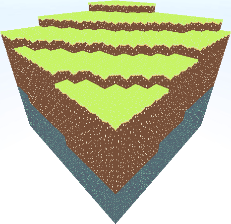 | 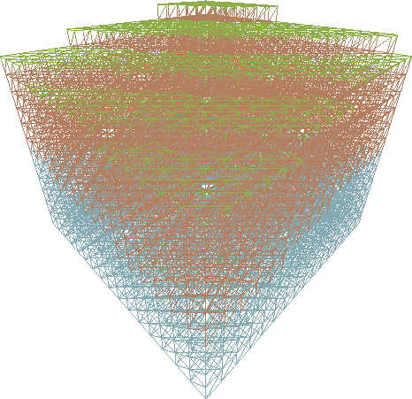 |
|:--:|:--:|
| Base | Naive method |

| 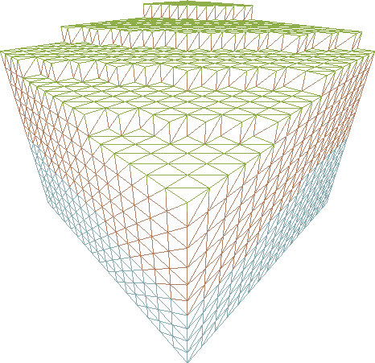 | 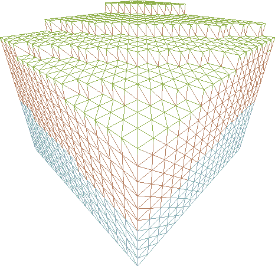 |
|:--:|:--:|
| Culling Method | Culling Method with GPU support |

| 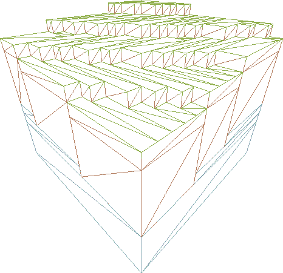 | 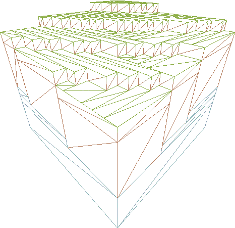 |
|:--:|:--:|
| Greedy Meshing | Binary Greedy Meshing |

### Raycast

| 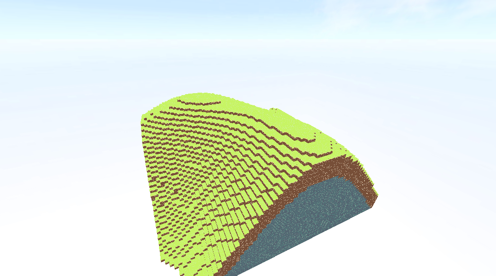 | 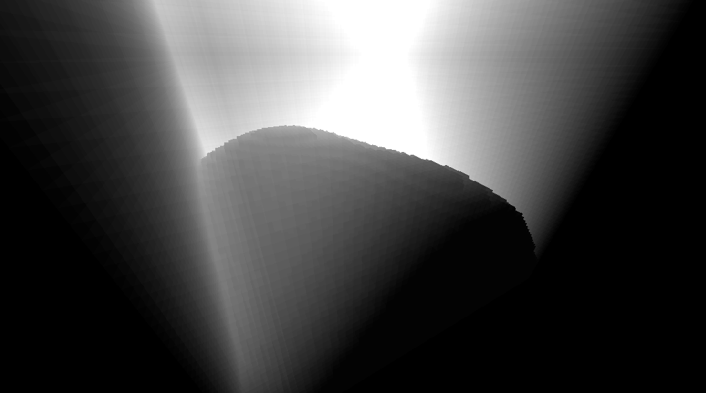 |
|:--:|:--:|
| Base | Flat |

| 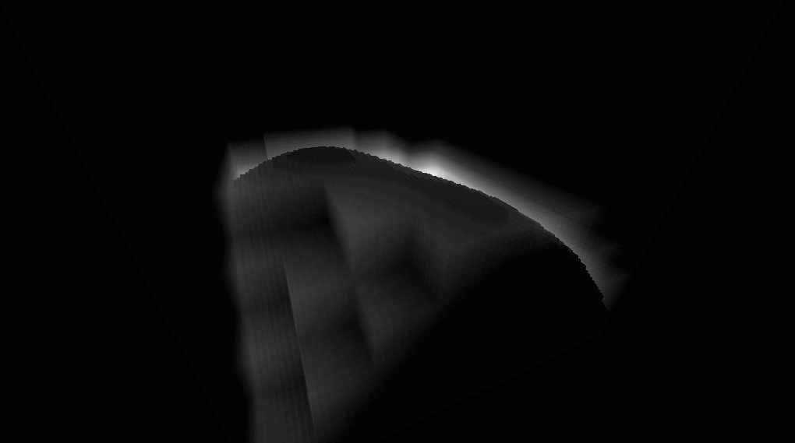 | 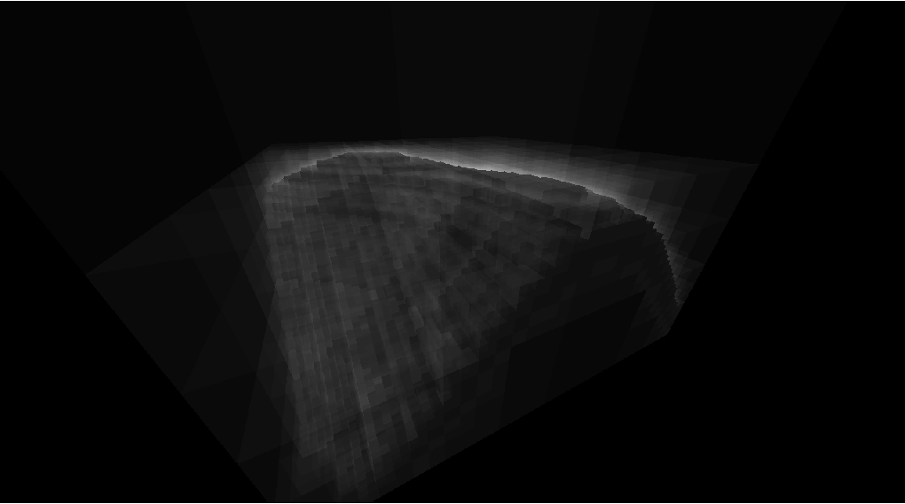 |
|:--:|:--:|
| Brickmap | Octree |

### Fast Voxel Traversal Algorithm

| 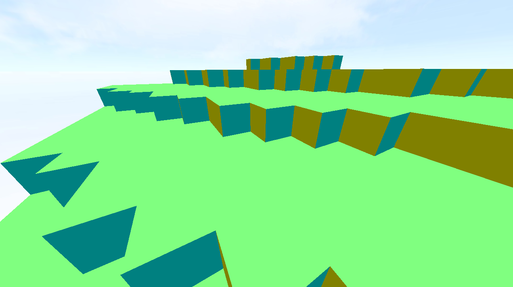 | 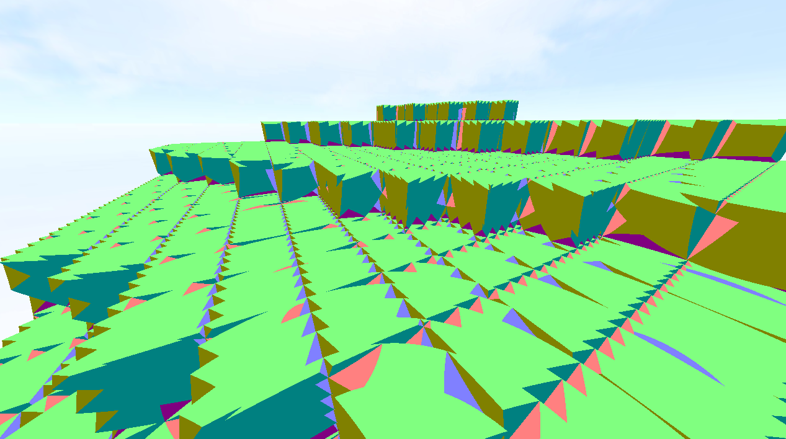 |
|:--:|:--:|
| Fast Voxel Traversal Algorithm  ~10'476'236 ray iterations | Fixed ray of length 0.2  ~33'831'991 ray iterations |

| 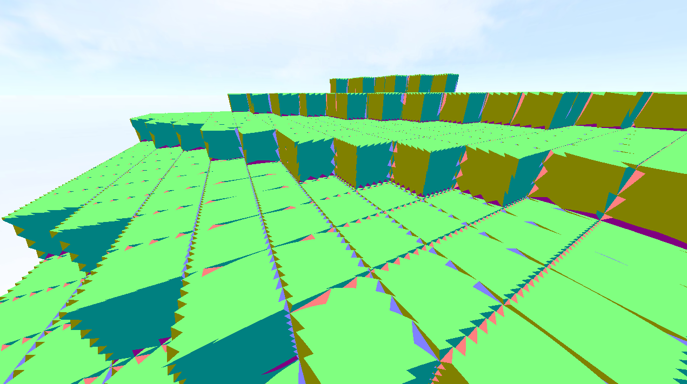 | 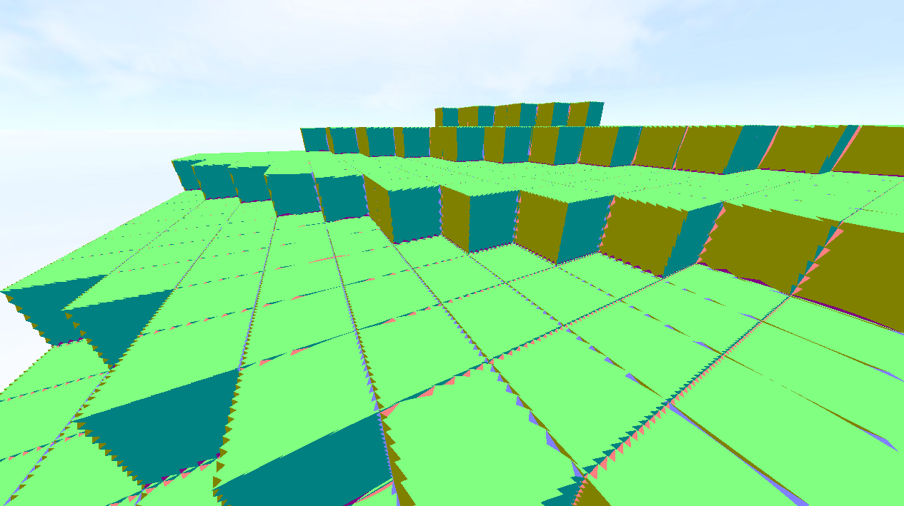 |
|:--:|:--:|
| Fixed ray of length 0.1  ~66'209'105 ray iterations | Fixed ray of length 0.05  ~130'390'387 ray iterations |

## Some of the results

    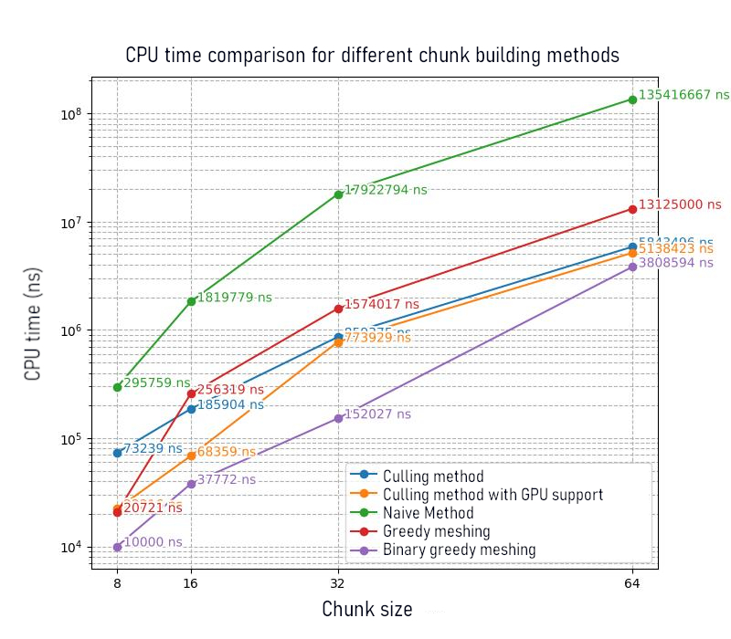
    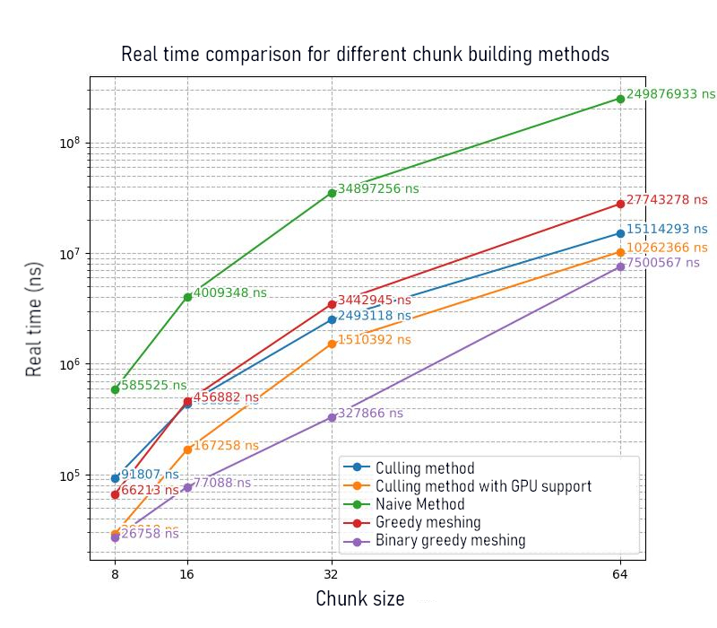
    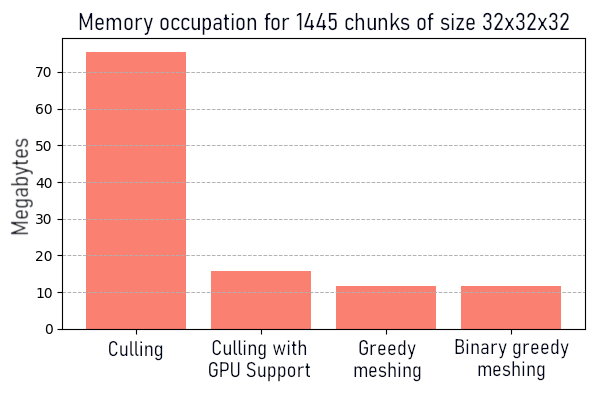

## Tools and Libraries
- **C++20**: The core programming language used to develop the environment.
- **OpenGL**: The primary API for rendering.
- **CMake**: Used as the build system for managing dependencies and compiling the project.
- **FastNoiseLite**: Procedural noise generation.
- **GLEW**: OpenGL Extension Wrangler for managing OpenGL extensions.
- **GLM**: OpenGL Mathematics, a header-only C++ math library.
- **imgui**: Immediate Mode Graphical User Interface for rendering interactive GUI.
- **imgui-sfml**: Integration of imgui with SFML.
- **minitrace**: Lightweight tracing library.
- **SFML**: Simple and Fast Multimedia Library for handling windows, and inputs.
- **spdlog**: Fast, header-only C++ logging library.
- **stb**: Single-file public domain libraries for image loading and other utilities.
- **Tracy**: Real-time, frame-based profiling library.
- **yaml-cpp**: A YAML parser and emitter for C++.

<h2>The thesis</h2>
<a href="readme/final_report.pdf">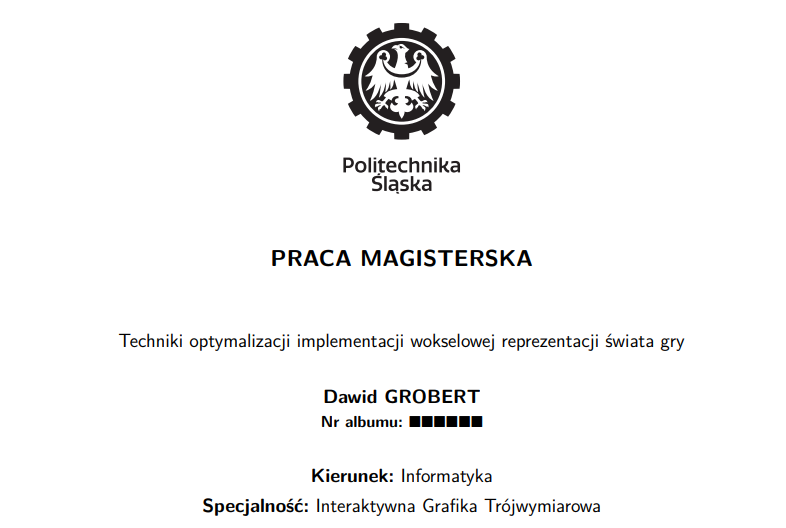</a>

You may find the thesis <a href="readme/final_report.pdf">here</a>

