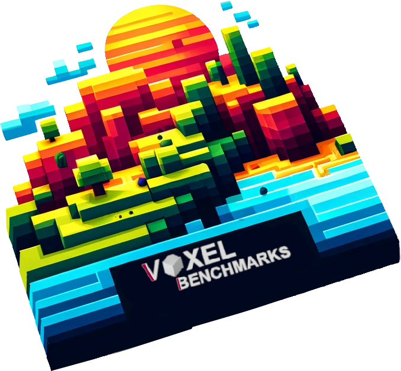

<h1>Voxel Techniques</h1>

 

This project now centers on exploring and comparing various optimization techniques within the context of voxel world generation and rendering. It's all about finding the most efficient methods 😊

## About the project

The project focuses on comparing multiple techniques for optimising voxel worlds therefore it will include many
different approaches and benchmarks. A side effect of this should be a quite optimised world generator and good
performance in terms of rendering this world.

## What's next?

Based on this, a voxel engine will be created:
[Voxino Engine](https://github.com/Notiooo/VoxinoEngine).